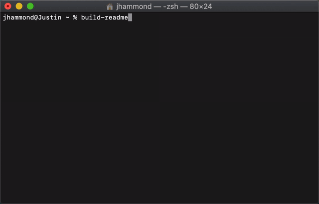

<div align="center"> 

<h1>Build Readme</h1>

Generate a Readme for your project with a simple CLI tool.

[](https://travis-ci.org/Justintime50/build-readme)
[](https://opensource.org/licenses/mit-license.php)



</div>

## Install

```bash
npm i -g build-readme
```

## Usage

Run the following command and follow the prompts to generate a README file.

```bash
build-readme
```

## Development & Testing

Install project dependencies locally and run linting:

```bash
npm i

npx eslint yourfile.js
```
